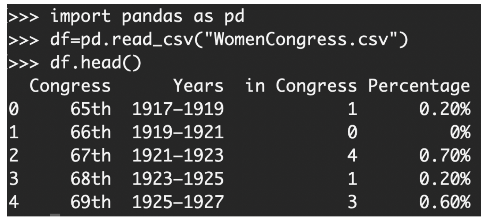

# Activities

<!-- TOC depthFrom:2 depthTo:6 withLinks:1 updateOnSave:1 orderedList:0 -->

- [Starters](#starters)
	- [Day 2: Variables, Types, & Lists](#day-2-variables-types-lists)
	- [Day 3: Pandas](#day-3-pandas)
	- [Day 4: Numpy & Statistics](#day-4-numpy-statistics)
	- [Day 5: Plotting](#day-5-plotting)
- [Screenless](#screenless)

<!-- /TOC -->

## Starters

[Google Slides](https://docs.google.com/presentation/d/1ZxkFTjXVx5EyF-P2CG3gV0U3dUskxzWrQPV9D9oA1Og/edit?usp=sharing)

### Day 2: Variables, Types, & Lists

1. What are the types of each of the following variables?

    - `name = “Lilah”`
    - `age = 6`
    - `weight = 161.4`
    - `is_dog = True`

1. Think back to our animals 2D list:

    ```
    animals = [['cat','dog','elephant'],
               ['fish','seahorse','whale'],
               ['robin', 'cardinal', 'bat']]
    ```
    - How can we isolate the aquatic animals sub-list?
    - How can we isolate ‘whale’ from the animals list?
    - How can we find the length of the animals list?
    - How can we find the length of the air animals sub-list?
    - BONUS: How can we add ‘gecko’ to the land animals sub-list?

### Day 3: Pandas

1. What data frame methods would you use to see what is at the beginning and end of your data frame?
1. How would you find the number of rows and columns in the data frame?
1. See the code in the screenshot. Which
command will result in '65th' printed
to the screen? Check all that apply.

    

    - `df.iloc[0,0]`
    - `df["Congress"][0]`
    - `df.iloc[0, :][0]`
    - `df.iloc[0, 'Congress']`


### Day 4: Numpy & Statistics

1. We have a list called `height_in`. We want to convert these values to cm by multiplying all the values by `2.54`. How can we do this using `numpy`?
1. What statistics can we use to learn about the average of our data? What are the `numpy` functions you’d use to calculate these?
1. Say we split our array into two arrays: `height_cm_males` and `height_cm_females`.
    - What test would we use to see if there is a significant difference in height between the male and female groups?
    - What package do we use to perform this test?
1. We want to see if there is a strong relationship between height and age.
    - What statistic can we compute to test this?
    - What is the `numpy` function to calculate it?


### Day 5: Plotting

1. What kind of plot do we use when we want to see the change in one variable over time?
1. What kind of plot do we use when we want to examine the relationship between two variables?
1. What kind of plot do we use when we want to see the distribution of a continuous variable?
1. What kind of plot do we use when we want to see the distribution of a categorical variable?
1. What parameter helps us color our plots by a certain variable?


## Screenless

- Free time with Ozobots
- [STEMinist parade](https://github.com/GWC-DCMB/ozobotLessons/tree/master/steminist_parade) with Ozobots
- Zip-Zap-Zop
    1.  Zip-Zap-Zop (ZZZ): Everyone stands in a circle. The goal is to pass the "energy" around the circle. Someone starts and they pass the "energy" to any other person in the circle by simultaneously saying "zip" while making eye contact and "passing a clap." To pass the clap, you have one arm out, bent, like you're about to give a handshake, and the other hand does a "drive-by": starting at the chest, extending to make the clap, and ending by pointing straight out toward the other person. Then the new person with the energy passes to someone else the same way (eye contact, pass the clap), but this time they say "zap" instead of "zip". Then the next person does the same but with "zop." Then you just keep going repeating those three words, always in that order, as needed. It's important to be ready at any time because you never know when it's going to come to you. It's also important to make eye contact and make a clear point so the person knows when they have been passed to. The game should fall into a rhythm. Try to eliminate pauses. There should be some excitement in passing the energy. There may be a bunch of mistakes at first if people aren't focused, and people generally get better with practice.
    1. ZZZ with Names: To learn each other’s names, do all the same actions, but rather than using "zip-zap-zop" first do a round where they just say their own name when passing the energy. Then do a round where they say the name of the person they are passing to. Then do a round where they say the name of the person that passed the energy to them (the first person has to make something up).
    1. ZZZ expert name: You make eye contact and pass the clap, but say a random name. The energy passes to the person whose name was said, not to who was pointed to.
- Improv story
    - Stand in a circle and say one word at a time to create a story around the circle. You can pick some topics for the story by having group members answer questions like what sport did you play as a child, what story did you like as a child, where is a place you want to go, what is an object you can hold in your hand. Try to use proper nouns like names instead of he/she when possible.
- Pitch an app
    - Think about an app that would be beneficial to your community or the world. How would you convince someone that your app is important and significant? A pitch! That doesn't mean you're going to throw it across the room like a baseball player! A pitch is a short story that people can tell about something they've created to get listeners excited and make them want to learn more. Pitches can take many different forms. They can be something you say to another person, a formal presentation, an email, or even a video. Make a pitch about your app!
- Stand-ups
    - What did you accomplish this meeting? Give an example of how you were brave, resilient, creative, or purposeful.  Do you need help with anything next meeting? Shout out a Clubmate for something they accomplished.
- Write thank-you cards to our sponsors.
