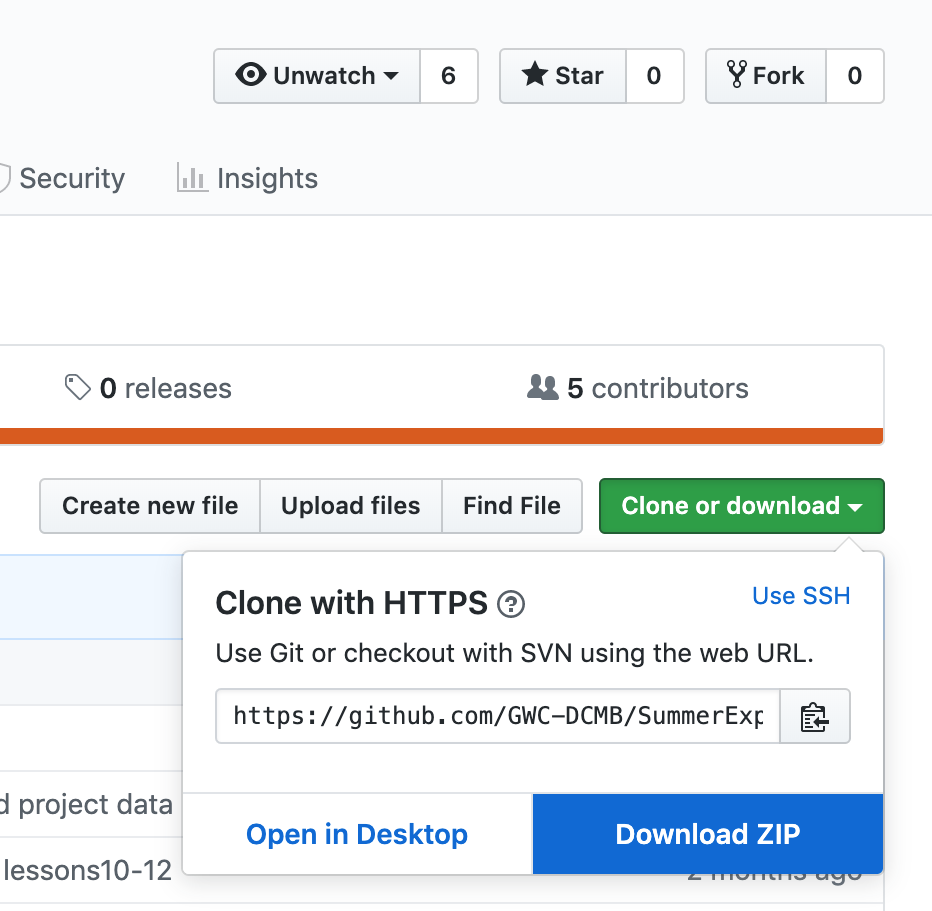
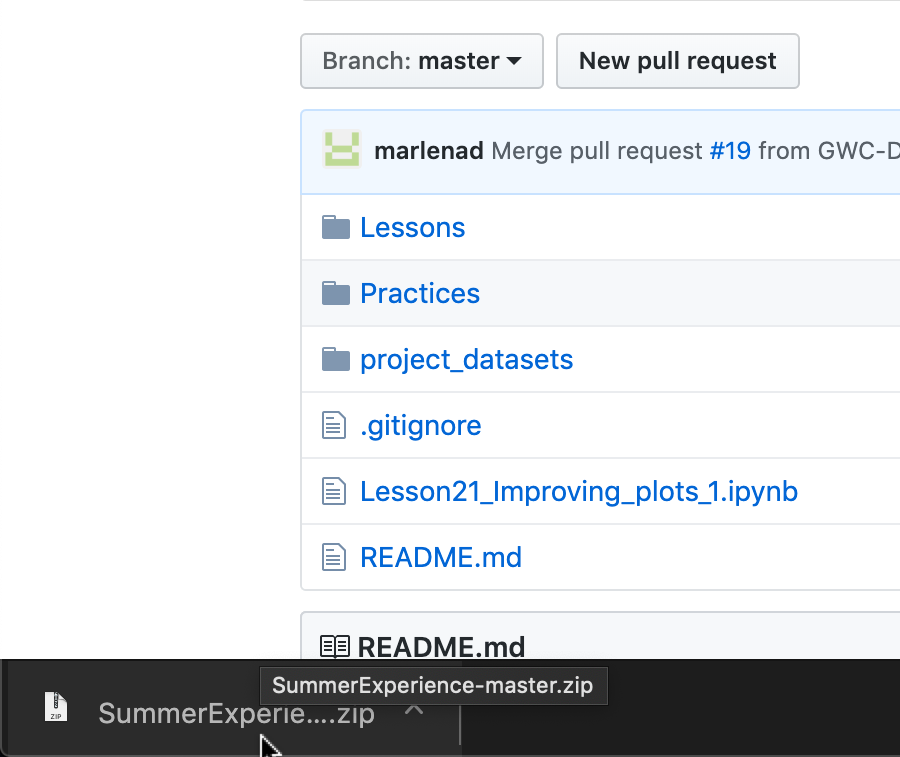
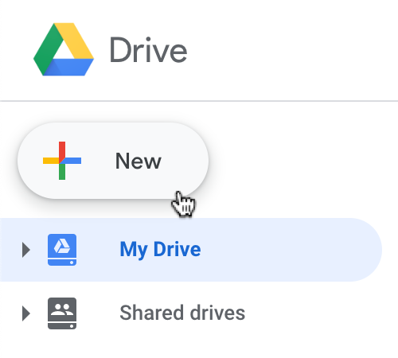
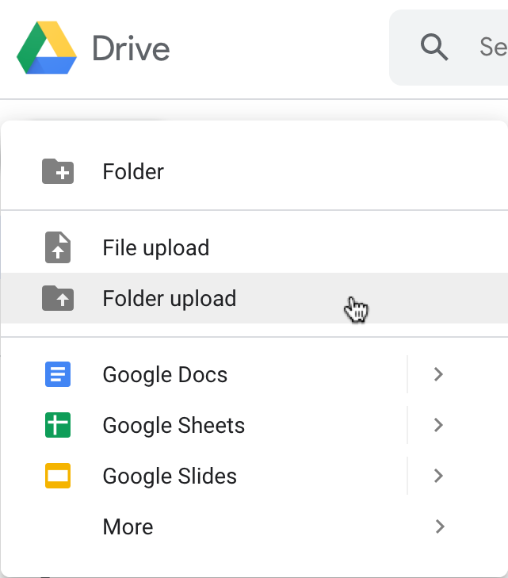
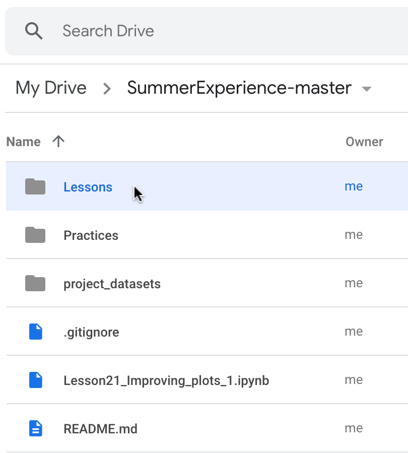
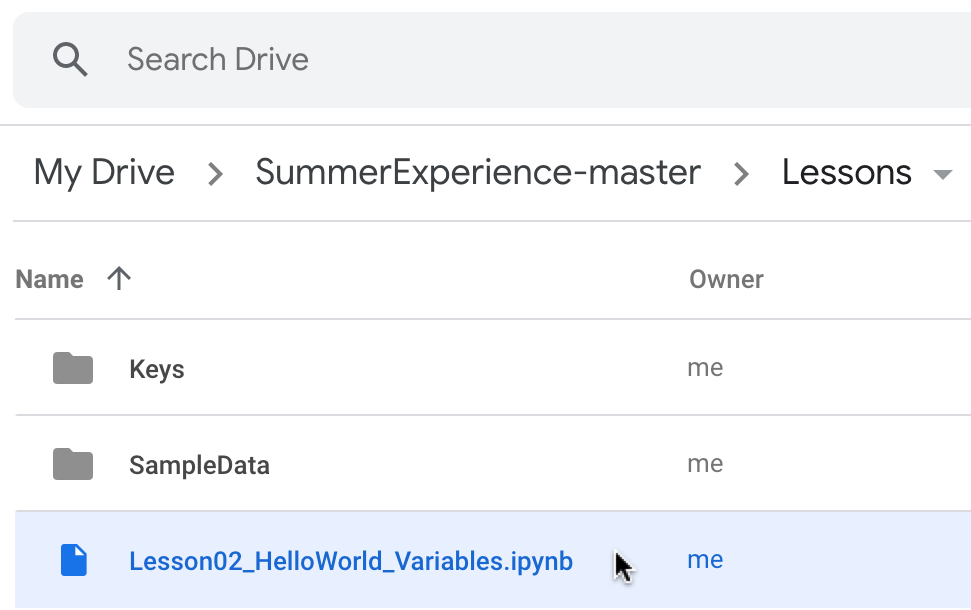
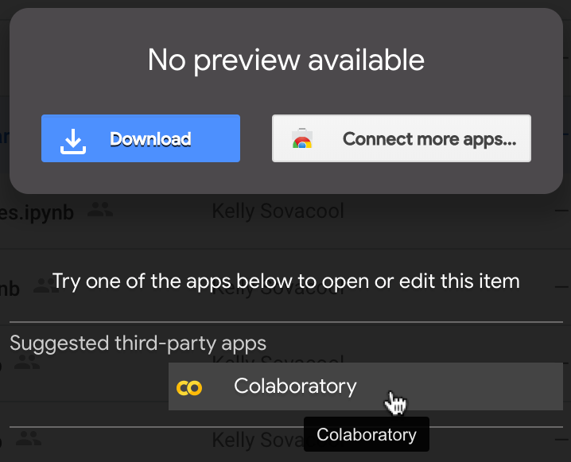
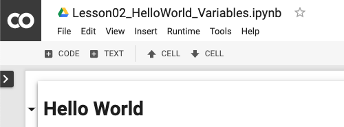

# Setup

1. Go to https://github.com/GWC-DCMB/SummerExperience
1. Click the green "`Clone or download`" button, then click "`Download ZIP`". 

1. In the bottom left, click the file to unzip it.                            

1. Go to https://drive.google.com and log in to your Google account.
1. In the upper left, press "`New`".                                      

1. Click "`folder upload`" and select the folder `SummerExperience-master`.

1. Double-click the folder `SummerExperience-master` to open it.
1. Double-click the `Lessons` folder.                                      

1. Double-click the notebook `Lesson02_HelloWorld_Variables.ipynb`.

1. Click "`Colaboratory`" to open the notebook with Google Colab.

1. When Colab loads, you should see something like this:

Congrats, you're ready to start coding!

